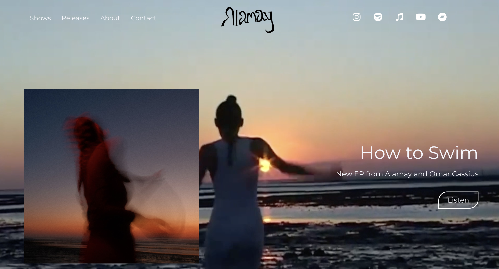

# Alamay-Site
https://alamay.cloudaccess.host/

This responsive website provides information about Alamay's music, including details about upcoming shows; an embedded music player for in-built listening to her feature on Refuge Worldwide radio; and a gallery of her most popular song releases.

The site was built in WordPress using Elementor for design, along with some custom CSS and HTML. GSAP was incorporated to add animation. Additionally, the site utilises Google's Gmail API with the SMTP mail plugin to enable users to submit a contact form seamlessly, complete with reCAPTCHA for added security.
